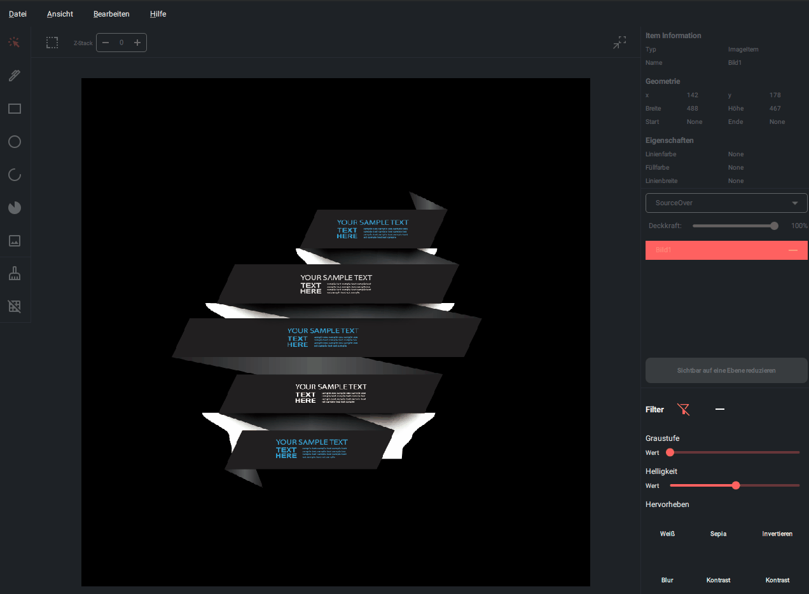
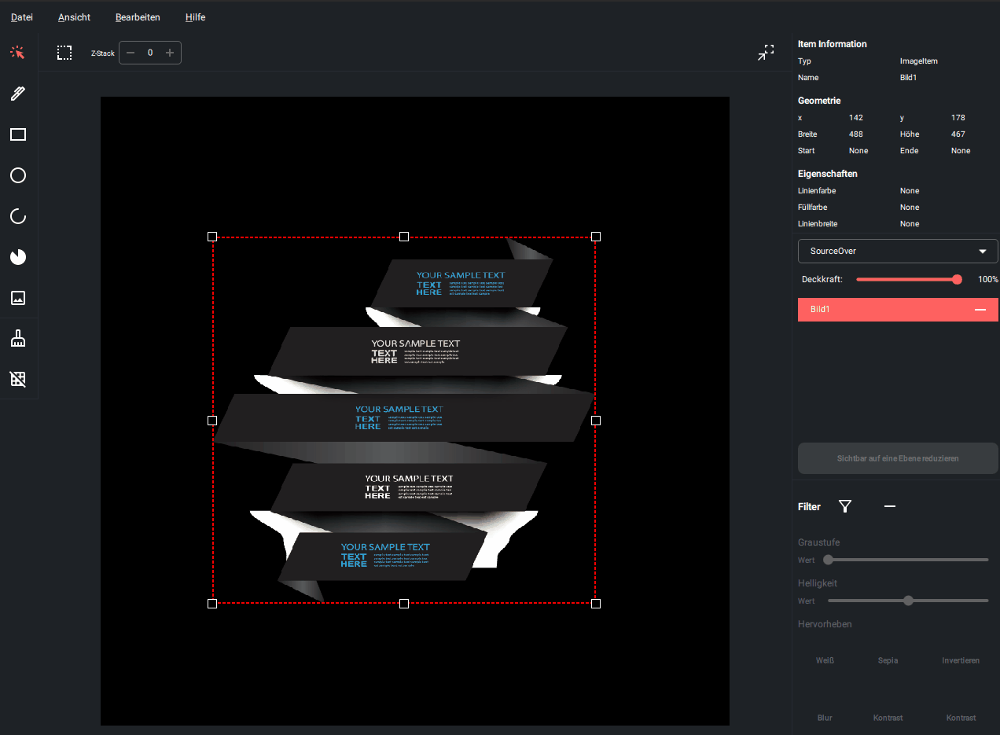
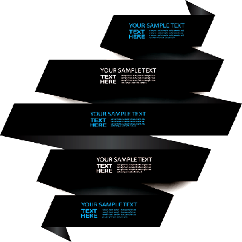

# Projekt Canvas Paint Light
### Dokumentation

D
as Projekt wurde in Qml geschrieben und die Schnittstelle zum Zeichnen mit C++ Qt geschrieben.
Um gleich Missverständnisse auszuräumen betone Ich, dass QML ( Qt Modelling Language ) auf JavaScript basiert:

Qt 5.x verwendete V8 als JavaScript-Engine.
Qt 6 hat die V8-Engine durch QuickJS ersetzt

Die Anwendung enthält eine breite Palette von inline Ausdrücken wie zB:

```js
colorOverlayColor: btnHighligtWhite.checked ? Theme.highlight : "transparent"
```
oder 
```js
property bool darkMode: true
property color background: darkMode ? '#1e2227' : 'white'
property color itemBackground: darkMode ? '#21252b' : '#d0d0d0'
property color borderColor: darkMode ? '#272b33' : '#bcbcbc'
property color foreground: darkMode ? '#d0d0d0' : '#272b33'
property color highlight: darkMode ? '#ff6160' : '#90caf9'
```


[w]

### Mein persönliches Ziel dieses Projektes war es, so viele Funktionalitäten wie möglich einzubinden. So ergeben sich:

#### - 9 Klassen in JavaScript ( eine in C++ -> CanvasEngine )
#### - ca 110 Methoden und Funktionen.
#### - 15 Qml Komponenten ( HelpDialog.qml, Theme.qml, Constants.qml und NewImageDialog.qml sind [unten](#qml---komponenten) nicht abgebildet )
#### - ca 5300 Zeilen ( mit Schnittstelle und Komponenten )


### Info zu den benutzten Icons

####  - Alle benutzten Icons sind von Google. Die Quelle ist im Code für jedes Icon so


---


## Klassen


Die abstrakte Klasse dienen als Datencontainer und können wegen :

```js
class AbstractItem {

    constructor(x, y, width, height) {
        if (new.target === AbstractItem)
            throw new Error('Die Abstrakte Klasse AbstractItem kann nicht instanziiert werden.');
        
        ...
    }
}
```
nicht instanziiert werden, was der Klasse einen *abstrakten* Stil gibt.


---

## Funktionalitäten

> Die Anwendung enthält round about 110 Methoden und Funktionen. Von Zeichenoperationen bis hin zur Darstellung
> auf dem Screen. Hier ist eine Vorschau im gif - Format, die Selbst sprechend sein soll.


Hier wird gezeigt, wie man ein Neues Fenster erstellt. 


Öffnen eines Bildes und hinzufügen ober die Menübar


Speichern eines Bildes als PNG


Formen hinzufügen


Z - Stack, bzw die Reihenfolge der Items ändern.


Zoomen


Hier wird gezeigt wie man ein Item umbenennt


Ansichten im Überblick.


Positionieren mit dem Tool.


Element entfernen.


Alles löschen.


Helligkeit - Filter



Der Graustufenfilter



Alle anderen Filter angezeigt.


Ebenen Transparenz


Ebenen zu einer zusammenfassen


Shortcut Übersicht


Kompositionen


WASD Movement, wenn das Selection - Rect ausgewählt ist.


---


--- 

## QML - Komponenten

Alle implementierten Komponenten kurz gezeigt und beschrieben.


---

### Die CanvasEngine - Komponente
Die Schnittstelle zum Zeichnen, die aus Qt implementiert wurde.


---

### Das SelectionRect - Komponente

Umrandet alle Items und bewegt diese in bestimmte Richtungen. Kann die Größen verändern und mit WASD bei
Selektion bewegt werden.


---

### Die ImageBar - Komponente
Kann alle Items auf der CanvasEngine entfernen und ein Raster ein und ausblenden.


---

### Die ShapeBar - Komponente
Enthält alle implementierten Formen zum Zeichnen und ein Auswahl - Tool.


---

### Die ShapeToolBar - Komponente

Hält für die Formen verschiedene Einstellungen bereit, wie Höhe, Breite, Füllfarbe und einiges mehr.


--- 

### Die MyMenuBar - Komponente

Die Menübar verwaltet die Komponenten und hat noch zusätzliche Optionen, wie das Speichern von Bildern
und die Einstellung des RenderHints ( Antialiasing, SmoothPixmapTransformation ... )


---

### Die ItemInformation - Komponente

Zeigt Informationen wie beispielsweise die Geometrie der aktuellen Form an.


---

### Die LayerItem - Komponente

Hier finden sich verschiedene Ebenen. Diese werden nach Erstellen einer Form hinzugefügt. Diese erlaubt
noch zusätzliche Bearbeitung, wie zB Komposition oder die Deckkraft einer Form.


---

### Die FilterItem - Komponente

Enthält Filter - Einstellungen für das komplette Bild und kann auch gespeichert werden 


### Hier sind einige Beispiele:

## $$ Ohne Filter $$


## $$ Kontrast $$



## $$ Invertiert $$


## $$ Sepia Filter $$


